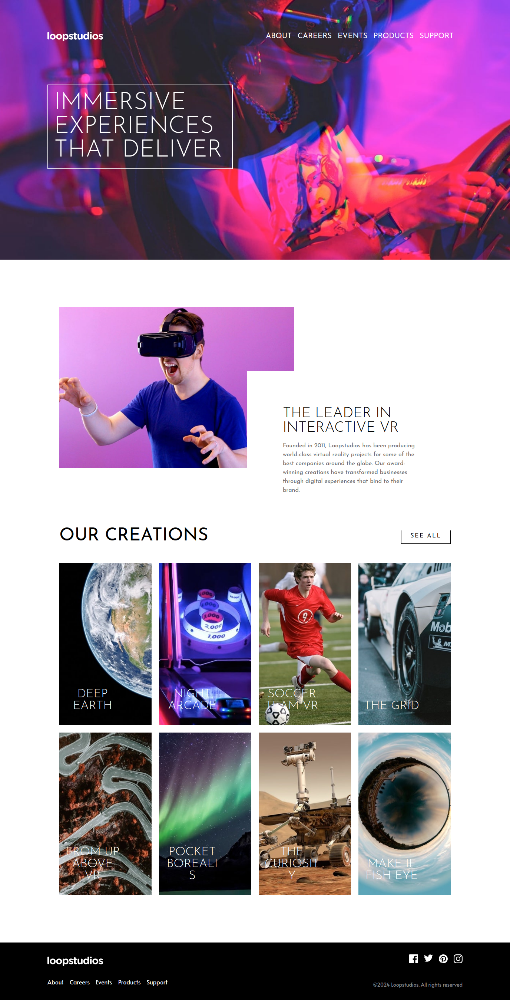
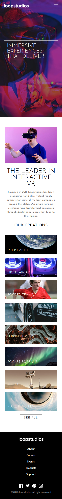

# Frontend Mentor - Loopstudios landing page solution

This is a solution to the [Loopstudios landing page challenge on Frontend Mentor](https://www.frontendmentor.io/challenges/loopstudios-landing-page-N88J5Onjw).

## Table of contents

- [Overview](#overview)
  - [The challenge](#the-challenge)
  - [Links](#links)
  - [Screenshot](#screenshot)
- [My process](#my-process)
  - [Built with](#built-with)
- [Author](#author)

## Overview

### The challenge

Users should be able to:

- View the optimal layout for the site depending on their device's screen size
- See hover states for all interactive elements on the page

### Screenshot
  # Desktop
  
  # Mobile
  
### Links

- Solution URL: [solution](https://github.com/Medido1/Frontend-Mentor-Loopstudios-landing-page)
- Live Site URL: [live site](https://medido1.github.io/Frontend-Mentor-Loopstudios-landing-page/)

## My process

### Built with

- Semantic HTML5 markup
- CSS custom properties
- Flexbox
- CSS Grid
- Mobile-first workflow

## Author

- Frontend Mentor - [@Medido1](https://www.frontendmentor.io/profile/Medido1)
- Github -          [@Medido1](https://github.com/Medido1)
- contact me bousalah.moh@gmail.com
